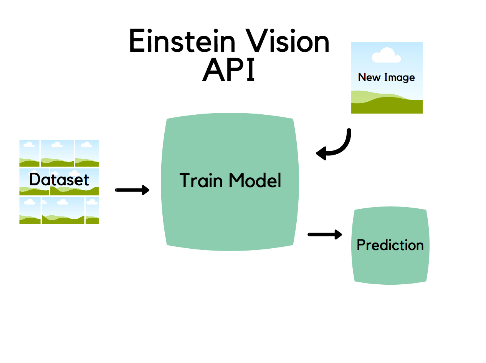

# PinPoint
## REI Hiking Application
### Responsive Web/Mobile Einstein Vision Application
#### PinPoint is an Image Recognition Application that allows users to take a photo and learn the details of the photo contents. Meant to be used while hiking, this Application aims to bridge the gap between objects in nature that hiker's know about, and those they do not know about. It's as simple as taking a photo of the unknown.
##### For Demo/MVP purposes, please use Chrome and Install the 'Allow-Control-Allow-Origin: * ' Chrome Extension.

## Part 1
### Story
#### When hiking out in nature, many hikers are unaware of the identity of the flora and fauna around them. When a hiker stumbles upon a bird they have never seen, they have no way of knowing what kind of bird they are looking at. In a similar sense, if a hiker stumbles upon a plant species that they cannot quite identify, how can they be sure that the plant is not poisonous to the touch? Many times, hikers get themselves into trouble, or fail to identify the beauty around them due to their lack of knowledge of the outside world. What if there was a way to bridge the gap between the unknown and the known?
### Solution
#### Picture this, a hiker takes a photo of something unknown, uploads the photo to an app, and the app return a set of data about the picture they sent it. With PinPoint, it's as easy as taking a picture of the unknown.

### Solution Architecture Diagrams
#### Solution Architecture for Static Demo/MVP Working App:

### Broader view of app functionality:
#### Add Node.js Backend with PostgreSQL Database, Express, and use Super Agent.
#### Solution Architecture for FrontEnd/BackEnd (relational database) App:

## Part 2
### Use of Einstein API:
#### Image Recognition AI using https://api.einstein.ai/v2/vision/predict
##### How the API Works:

### Working Prototype:
#### https://pinpointrei.herokuapp.com/

## Challenges
### CORS - Cross-Origin Resource Sharing
#### CORS is a mechanism that uses additional HTTP headers to let a user agent gain permission to access selected resources from a server on a different origin (domain) than the site currently in use. A user agent makes a cross-origin HTTP request when it requests a resource from a different domain, protocol, or port than the one from which the current document originated.
#### An example of a cross-origin request: A HTML page served from http://domain-a.com makes an  src request for http://domain-b.com/image.jpg. Many pages on the web today load resources like CSS stylesheets, images, and scripts from separate domains, such as content delivery networks (CDNs). For security reasons, browsers restrict cross-origin HTTP requests initiated from within scripts. For example, XMLHttpRequest and the Fetch API follow the same-origin policy. This means that a web application using those APIs can only request HTTP resources from the same domain the application was loaded from unless CORS headers are used.
#### Quick fix to the CORS issue:
##### Install Allow-Control-Allow-Origin: *  Extension from the Chrome Web Store. You can install it here: https://chrome.google.com/webstore/detail/allow-control-allow-origi/nlfbmbojpeacfghkpbjhddihlkkiljbi?hl=en
##### You can also you CORS Toggle Chrome Extension, which allows you to toggle CORS on and off. You can install it here: https://chrome.google.com/webstore/detail/cors-toggle/jioikioepegflmdnbocfhgmpmopmjkim
##### Otherwise, you will get this error: "No ‘Access-Control-Allow-Origin’ header is present on the requested resource. Origin ‘null’ is therefore not allowed access."
#### Long-term fix to the CORS issue:
##### Using JSONP - this technique has been used for a long time for online services and cross domain requests, but the remote services need to use it. It consists of dynamically adding a script element in the HTML page to execute the request. When the response is received, the corresponding code is parsed and executed as JavaScript.
##### You can read more here http://restlet.com/company/blog/2016/09/27/how-to-fix-cors-problems/
##### Setting CORS headers correctly (everyone seems to have a different opinion and the only fix I found was the Chrome Extension).
#### Mobile CORS fix:
##### With the team, I would love to work collaboratively to solve this problem.
##### Techniques I tried in order to debug CORS error on mobile chrome:
##### Whitelisting the origin on Salesforce. You can read more here: https://developer.salesforce.com/docs/atlas.en-us.chatterapi.meta/chatterapi/extend_code_cors.htm
##### Including Allow-Control-Allow-Origin:* to php headers.
##### Creating the XMLHttpRequest object. More information here:
https://www.html5rocks.com/en/tutorials/cors/

### Heroku
#### Heroku Supports projects built in Node.js, Ruby, Java, PHP, Python, Go, Scala, and Clojure.
#### In order to deploy to Heroku, you cannot use a static site. However, for Demo/MVP purposes, I chose to build a static web/mobile app and found a work around.
#### How to Deploy a Static Site on Heroku:
#### You can trick Heroku to deploy a static site by including 1 dynamic file - index.php. The index.php file will be served by Heroku before the index.html, so you need to make the browser redirect from index.php to index.html, by including <?php header( 'Location: /index.html' ) ;  ?> in the index.php file.

### FileReader() - Uploading Files with AJAX
#### When calling the Einstein Vision API, I kept getting a '400 Bad Request' response no matter what information I seemed to pass the AJAX call.
#### I had to pass the file object to the reader.readAsDataURL method. This creates a data url for the uploaded image. The data url isn’t passed back from the function, instead, the data url will be part of an event object. Then I needed to register a function on the reader.onloadend event. This function takes an event object, by which gets the data url: it’s at e.target.result (e.target is the reader object) but I had issues when using reader in place of e.target inside this function). We’re just going to pass this data url to our showUploadedItem function. Lastly, if the browser supports FormData, formdata will be a FormData object. So with the FormData object, I call the append method - the purpose of a FormData object is to hold values that you’re submitting via a form; so, the append method simply takes a key and a value.

### Mobile App
#### Ionic & React Native
#### I have never built a fully functioning native or mobile only app. In the first two days of the project, I tried to get up an running with either a react native or ionic app, and then realized my passion is for web and chose to develop a mobile responsive web application instead. However, I would love to eventually learn mobile development with react native. Using the Expo app to run from the QR code created when firing up npm start in the react native app directory, I fell in love with the simulators and native components. Lastly, I sense that react native while become the de facto way to even create a web application, so I would like to move in this direction soon.

## Improvements:
### Add Feedback to and Retrain a Model
#### By sending an image to https://api.einstein.ai/v2/vision/feedback, you can use the feedback API to add a misclassified image with the correct label to the dataset from which the model was created. Then, after you add feedback images to the correct classes in the dataset, you retrain the dataset to incorporate the new data into the model with the retrain API https://api.einstein.ai/v2/vision/retrain.
### Upload multiple images at the same time.
#### Allow user to upload several images at a time, and get results for all photos.
### Give users the ability to choose between text, file etc.
#### If the user decides to upload a different type of file (rather than an image), the app needs to be able to support this functionality rather than returning and error message of 'unsupported media type.'
### Provide further details about returned object.
#### I want to add a feature the provides the user with some context around the object in the picture. If the picture contains a poisonous plant, I want the app the warn the user not to touch the plant. In addition, I also want to return a wiki link about the object to the user. The wiki link of course containing more information about the object in question.
